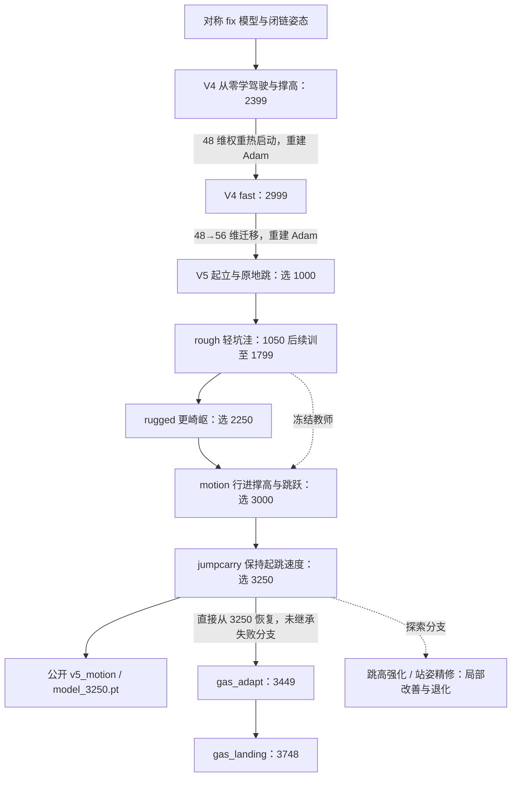

# 预训练策略是怎样一步一步得到的？

先回答最容易混淆的问题：`pretrained/v5_motion/model_3250.pt` 不是从随机动作直接训练跳跃得到的，也不是历史 `v5_motion` 阶段的原始输出。它是经过平衡驾驶、加速、起立跳跃、地形适应、组合动作、保速跳跃之后，选出的 `v5_jumpcarry` 检查点。公开目录为方便使用命名为 `v5_motion`。

本页解释**真实实验路线**；[从头训练操作指南](FROM_SCRATCH.md) 给出当前代码的分阶段命令。历史配置字段取自原运行的 `run.json`，脱敏证据在 [training_lineage.json](../reports/training_lineage.json)。早期全部权重和逐阶段源码快照未发布，因此不能承诺重新执行当前代码会逐位重现历史权重。

## 一张图看主线

图中数字是检查点迭代标签，不是每阶段独立训练轮数；续训会沿用计数，热启动和网络扩维阶段会重置部分训练状态。候选检查点经过评估后选用，不要求选择最后一轮。

## 每阶段到底教了什么？

| 阶段 | 输入与训练方式 | 解决的问题与课程 | 进入下一阶段前检查 |
|---|---|---|---|
| 模型整理 | 原模型 → `training_scene_fix.xml`；无策略训练 | 修正左右质量/惯量及运动学；检查闭链；建立不同腿高的相容姿态 | 镜像误差、闭链残差、落地姿态、驱动力方向 |
| V4 | 随机初始化；512 环境，2400 轮；选 2399 | 先学低速前后、转向释放制动、静止撑高和自转；48 维观测、6 维动作 | 站稳、前后与左右方向、高低站姿、停车、自转 |
| V4 fast | V4 2399 热启动；512 环境，3000 轮；选 2999 | 纠正用户前进方向；速度课程到 1.3 m/s；加快高度指令；加强速度/高度跟踪和制动 | 实测 1.3 m/s 跟踪、快速升降、自转保持、松开后停稳 |
| V5 | 从 fast 2999 扩维迁移；1024 环境，1200 轮；选 1000 | 加 8 维阶段信息；先从收腿姿态站起，再加入原地小跳；目标净空 2–6 cm | 收腿起立、双轮真实离地、连续腾空、落地站稳及旧驾驶技能 |
| rough | 从 V5 1000 恢复；启动段到 1050 后另续 750 轮至 1799 | 地形最高 ±1.5 cm；保留平地；高度改为相对地面；以 V5 1000 为教师 | 车辆驶离平坦出生区后的跟踪、独立地形稳定性、平地技能保留 |
| rugged | 从 rough 1799 恢复；追加 600 轮；选 2250 | 地形最高 ±6 cm、降低平滑；教师仍来自 V5 1000 | 低/高难度坑洼与波浪、制动，以及平地起立/跳跃/自转 |
| motion | 从 rugged 2250 恢复；rough 1799 为教师；追加 900 轮；选 3000 | 速度课程到 2 m/s；允许行进时撑高和触发跳跃；把落地“停住”改成跟踪运动目标 | 起跳前确实已在移动；跳跃过程中持续前进；撑高延迟、落地跟踪 |
| jumpcarry | 从 motion 3000 恢复，同一权重作教师；追加预算 400 轮；选 3250 | 保存起跳瞬间的世界坐标水平速度，各阶段跟踪它，惩罚减速 | 分阶段最低保速比例、速度误差、轮子净空、落地存活；回归站立与制动 |
| gas_adapt | 直接从 jumpcarry 3250 恢复；同一教师；追加 200 轮 → 3449 | 加两侧恒力气弹簧，假设每侧 200–300 N；先做 stance 适应，不直接大量自动跳跃 | 力的单位与实际作用、负载、四档推力动态测试、长时站姿 |
| gas_landing | 从 gas_adapt 3449 恢复；同一教师；追加 300 轮 → 3748 | 改腾空收腿到落地伸腿的切换；消除相互冲突奖励；保留跳前速度 | 跳跃保速与净空联合验收，同时检查静止/制动是否退化 |

rough 的启动配置原计划 800 轮，但实际后续运行从 1050 另续 750 轮；不能把配置预算当作已经完整执行的独立轮数，也不能把 800 和 750 相加说成完整训练量。表中运行关系以原记录为依据。

## 为什么不是一次把所有奖励加上？

随机策略连平衡都不会时，跳跃奖励很少得到有效样本。先学驾驶得到可用姿态和电机控制，再加入起立与跳跃阶段，能让后续任务从有意义的状态开始。V5 先保留 V4 前 48 维输入的权重与归一化统计，新 8 维输入权重初始化为零；这样扩维时已有行为不会立即被随机新输入破坏。网络结构变化后重建 Adam，与后续完整恢复优化器的续训不同。

地形训练改变了状态分布，因此先轻坑洼、再更崎岖，并保留平地样本和冻结教师。教师是旧策略提供动作参考，并不替学生做动作；学生由 PPO 更新。motion 阶段教师仅约束原本会的低速低姿区域，避免旧教师阻碍新的高速组合。

行进跳跃又发现“给了前进指令”不等于“跳时不减速”，于是 jumpcarry 改为跟踪**实际起跳速度**。气弹簧试验进一步发现，整车抬高不等于轮子能越障，故把轮子净空、收腿和落地时序分别处理。

## 三种加载方式必须分清

| 参数/方式 | 谁初始化学生 | 优化器 | 典型阶段 |
|---|---|---|---|
| 无加载参数 | 随机初始化 | 新建 | V4 |
| `--warm-start` | 兼容 actor/critic 与归一化 | 新建，计数重启 | V4 → fast |
| V5 `--source` 扩维迁移 | 前 48 维旧权重 + 8 维零权重 | 新建 | fast → V5 |
| rough/rugged `--source` + `--resume` | 有 resume 时从 resume 恢复；source 仍提供原教师 | 恢复 Adam，学习率覆盖 | 地形续训 |
| motion/jumpcarry/gas `--source` + `--teacher` | source 恢复学生；teacher 提供冻结参考 | 恢复 Adam，按代码调整学习率等 | 组合动作与气弹簧 |

这些参数在不同训练器中的语义并不完全相同。不要把 rough 的 source 换成 resume 路径来“简化命令”；这会改变教师及兼容条件。

## 哪些尝试没有成为主线？

早期按阶段蹭上台阶的 V6 方案失败，已弃用；后来的 V6 标签用于跳跃/站姿/气弹簧探索，版本号并不表示同一个连续训练任务。跳高强化与站姿精修有局部改善，也有明显技能遗忘，**gas_adapt 没有从它们的最终权重继承**，而是回到 jumpcarry 3250。

最新 gas_landing 也不是通用最优：匹配动态测试 9/32 → 8/32，部分 1.5 m/s 指令跳跃改善，长时静止退化。因此发布 V5 基线、中间 gas_adapt、最新 gas_landing 三者，供直接体验、复现对照与继续研究。详见 [结果与经验](EXPERIMENTS.md)。

## 你该从哪里开始？

- 只想看车动起来：根 README 的 V5 回放，完全不需要先训练。
- 想优化一个新能力：从公开检查点做两轮冒烟续训，再改变一项课程/奖励；参见 [续训指南](TRAINING.md)。
- 想理解预训练怎么产生：读完本页，按 [从零指南](FROM_SCRATCH.md) 跑 V4 → fast → V5，再逐段扩展。每段先验收，不要一口气跑完整长链。
